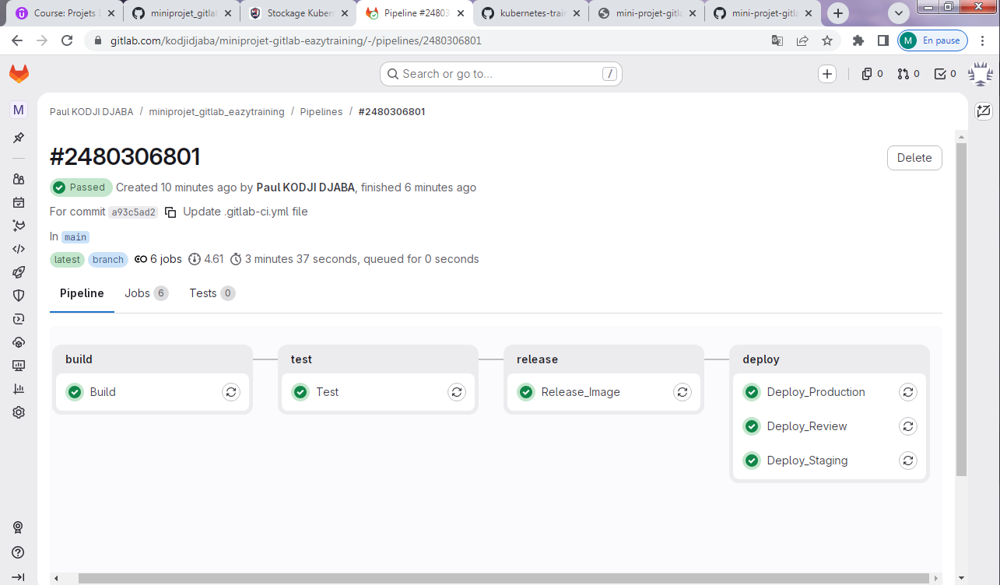

# 🚀 Mini-Projet GitLab CI/CD – EazyTraining

[](https://github.com/KODJIKanka/miniprojet_gitlab_eazytraining)
[](https://gitlab.com/kodjidjaba/miniprojet-gitlab-eazytraining)
[](https://aws.amazon.com/)
[](https://www.linux.org/)

## 📋 Description

Ce projet a été réalisé dans le cadre de la formation **EazyTraining** et a pour objectif de mettre en place un pipeline CI/CD complet avec **GitLab CI**, incluant les étapes de build, test, release et déploiement d'une application conteneurisée sur une infrastructure **AWS** provisionnée pour l'occasion.

---

## 🔗 Liens

- **GitHub** : [https://github.com/KODJIKanka/miniprojet_gitlab_eazytraining](https://github.com/KODJIKanka/miniprojet_gitlab_eazytraining)
- **GitLab (pipeline)** : [https://gitlab.com/kodjidjaba/miniprojet-gitlab-eazytraining](https://gitlab.com/kodjidjaba/miniprojet-gitlab-eazytraining)

---

## ☁️ Infrastructure AWS

### 1. Création du compte AWS

Avant tout déploiement, un compte **AWS** a été créé sur [https://aws.amazon.com](https://aws.amazon.com). Cette étape comprend :

- La création d'un compte root avec une adresse e-mail dédiée
- La configuration de la facturation et la mise en place d'un budget d'alerte pour éviter les dépassements de coûts
- La création d'un utilisateur **IAM** (avec les droits appropriés) pour ne pas utiliser le compte root au quotidien
- La génération des **Access Key** et **Secret Access Key** nécessaires à l'intégration avec GitLab CI

### 2. Provisionnement de l'infrastructure

L'infrastructure cible a été provisionnée sur AWS pour héberger les environnements de déploiement de l'application. Les étapes réalisées sont les suivantes :

- **Lancement d'instances EC2** : des serveurs Linux ont été provisionnés pour héberger les différents environnements de l'application
- **Configuration des groupes de sécurité** (Security Groups) : ouverture des ports nécessaires (HTTP, HTTPS, SSH)
- **Configuration réseau** : mise en place d'un VPC avec sous-réseaux publics pour l'accès aux applications déployées
- **Paramétrage des accès SSH** : génération et association d'une clé SSH pour l'administration des instances
- **Intégration des credentials AWS dans GitLab CI** : les variables `AWS_ACCESS_KEY_ID` et `AWS_SECRET_ACCESS_KEY` ont été renseignées dans les variables CI/CD du projet GitLab afin que le pipeline puisse interagir avec l'infrastructure

---

## 🏗️ Architecture du Pipeline

Le pipeline CI/CD est défini dans le fichier `.gitlab-ci.yml` et s'articule autour de **4 stages** exécutés séquentiellement :

```
build ──► test ──► release ──► deploy (AWS)
```

| Stage       | Job(s)                                                   | Description                                      |
|-------------|----------------------------------------------------------|--------------------------------------------------|
| **build**   | `Build`                                                  | Construction de l'image Docker de l'application  |
| **test**    | `Test`                                                   | Exécution des tests automatisés                  |
| **release** | `Release_Image`                                          | Publication de l'image sur le registry           |
| **deploy**  | `Deploy_Production`, `Deploy_Review`, `Deploy_Staging`   | Déploiement sur les environnements AWS           |

---

## ✅ Résultats obtenus

### Pipeline GitLab CI – Statut : Passed

Le pipeline **#2480306801** a été exécuté avec succès sur la branche `main` en **3 minutes 37 secondes**, comprenant **6 jobs** tous passés au vert.



> Le pipeline enchaîne les 4 stages : **build → test → release → deploy**, avec 3 environnements déployés simultanément (Production, Review, Staging) sur l'infrastructure AWS.

---

### Application déployée sur AWS

À l'issue du pipeline, l'application a été correctement déployée et est accessible depuis l'infrastructure AWS provisionnée.


---

## ⚙️ Technologies utilisées

- **GitLab CI/CD** – Orchestration du pipeline
- **Docker** – Conteneurisation de l'application
- **AWS EC2 (Linux)** – Serveurs Linux provisionnés pour héberger les environnements de déploiement
- **AWS IAM** – Gestion des accès et des droits cloud
- **AWS VPC / Security Groups** – Configuration réseau et sécurité
- **GitLab Container Registry** – Stockage des images Docker

---

## 📁 Structure du projet

```
miniprojet_gitlab_eazytraining/
│
├── .gitlab-ci.yml        # Définition du pipeline CI/CD
├── Dockerfile            # Image Docker de l'application
└── app/                  # Code source de l'application
```

---

## 🔄 Fonctionnement du pipeline

### 1. Stage `build`
Construction de l'image Docker à partir du `Dockerfile` du projet.

### 2. Stage `test`
Exécution des tests pour valider le bon fonctionnement de l'application avant tout déploiement.

### 3. Stage `release`
Publication (`push`) de l'image Docker validée vers le GitLab Container Registry.

### 4. Stage `deploy`
Déploiement automatique de l'application sur l'infrastructure AWS, selon trois environnements :
- **Production** : environnement de production stable, accessible en public
- **Review** : environnement de revue pour validation avant mise en production
- **Staging** : environnement de pré-production pour les tests d'intégration finaux

---

## 👤 Auteur

**Paul KODJI DJABA**  
Formation EazyTraining – DevOps / Cloud AWS

---

## 📄 Licence

Ce projet est réalisé à des fins pédagogiques dans le cadre de la formation EazyTraining.
